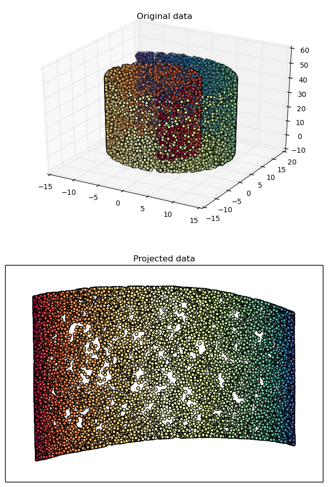
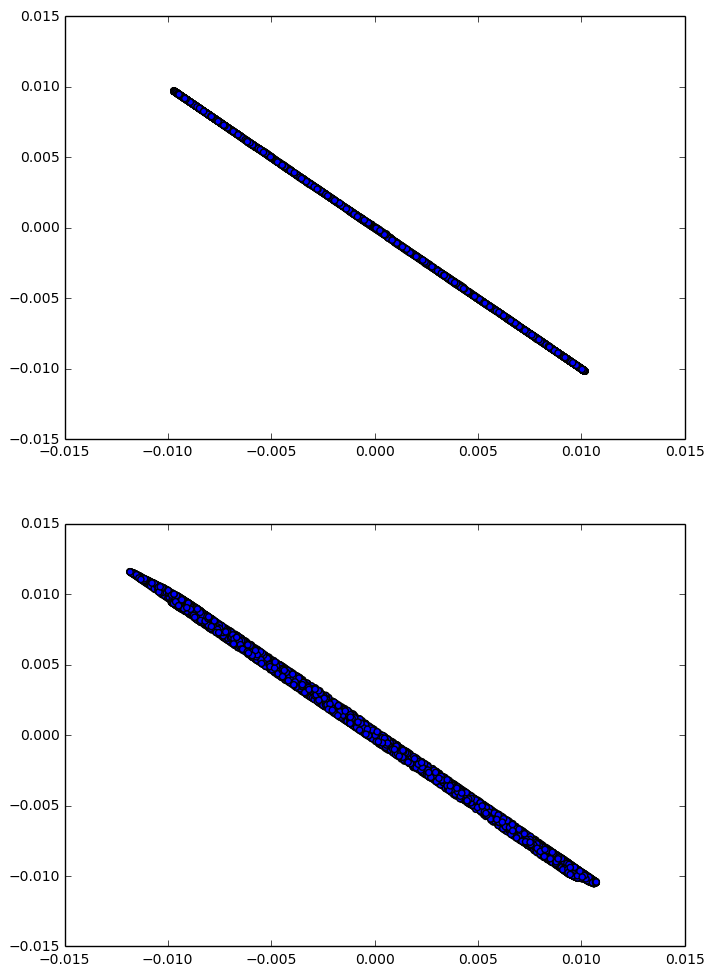
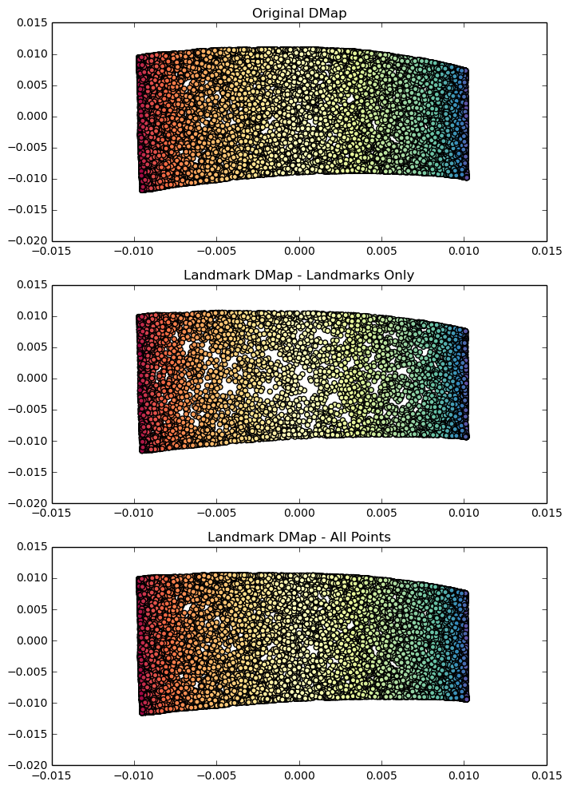

Python example for using the DMap/LDMap with a "Swiss roll" dataset

```python
%matplotlib inline
import PyDMap
import numpy as np
import scipy.io as sio
import scipy.spatial.distance as ssd
from scipy import stats
import matplotlib.pyplot as plt
plt.rcParams["figure.figsize"] = (8, 12)
```

Inputting the data
```python
matfile = sio.loadmat('swiss_roll_data.mat')
x_data = np.transpose(matfile['X_data'])
dists = ssd.squareform(ssd.pdist(x_data))
y_data = matfile['Y_data']
```

Properties for the DMap construction
```python
num_evec = 3
epsilon = 1.
```

Construct a diffusion map on the full dataset
```python
dmap = PyDMap.DMap()
dmap.set_dists(dists)
dmap.set_epsilon(epsilon)
dmap.set_num_evec(num_evec)
dmap.compute()
evecs = dmap.get_evec()
evals = dmap.get_eval()
```

Plotting the original 3D manifold, and the 2D diffusion map reconstruction
```python
fig = plt.figure()
from mpl_toolkits.mplot3d import Axes3D
Axes3D
ax = fig.add_subplot(211, projection='3d')
ax.scatter(x_data[:, 0], x_data[:, 1], x_data[:, 2], c=y_data[0,:], cmap=plt.cm.Spectral)

ax.set_title("Original data")
ax = fig.add_subplot(212)
ax.scatter(evecs[:, 1], evecs[:, 2], c=y_data[0,:], cmap=plt.cm.Spectral)
plt.axis('tight')
plt.xticks([]), plt.yticks([])
plt.title('Projected data')
plt.show()
```





Compute a set of landmarks via k-medoids, and then generate a landmark diffusion map manifold
```python
medoids,counts = PyDMap.kmedoids(dists, 6000)
medoids.astype('int64')
medoid_dists = np.take(np.take(dists,medoids,axis=0),medoids,axis=1)
ldmap = PyDMap.LDMap() 
ldmap.set_dists(medoid_dists)
ldmap.set_epsilon(epsilon)
ldmap.set_num_evec(num_evec)
ldmap.set_multiplicity(counts)
ldmap.compute()
l_evecs = ldmap.get_evec()
l_evals = ldmap.get_eval()
```

Since the eigenvalue solver may change the signs of the order parameters furnished by the diffusion map, this will perform a simple realignment (only needed for this demonstration, not in practice)

```python
fig = plt.figure()
ax1 = fig.add_subplot(211)
ax1.scatter(evecs[medoids,1], l_evecs[:,1])
ax2 = fig.add_subplot(212)
ax2.scatter(evecs[medoids,2], l_evecs[:,2])
plt.show()

align_evecs = l_evecs
for i in range(num_evec):
    slope, _, _, _, _ = stats.linregress(evecs[medoids,i],l_evecs[:,i])
    align_evecs[:, i] = np.sign(slope)*align_evecs[:, i]
ldmap.set_evec(align_evecs)
```





Compute the coordinates of the non-medoids points using the Nystrom extension
```python
dists_to_medoids = np.take(dists,medoids,axis=0)
l_nystrom = PyDMap.nystrom(ldmap,dists_to_medoids)
```

Plotting the resulting 2D manifolds
```python
fig = plt.figure()

ax1 = fig.add_subplot(311)
ax1.scatter(evecs[:, 1], evecs[:, 2], c=y_data[0, :], cmap=plt.cm.Spectral)
ax1.set_title("Original DMap")
lim_x = ax1.get_xlim()
lim_y = ax1.get_ylim()


ax2 = fig.add_subplot(312)
ax2.scatter(align_evecs[:, 1], align_evecs[:, 2], c=y_data[0, medoids], cmap=plt.cm.Spectral)
ax2.set_title("Landmark DMap - Landmarks Only")
ax2.set_xlim(lim_x)
ax2.set_ylim(lim_y)


ax3 = fig.add_subplot(313)
ax3.scatter(l_nystrom[:, 1], l_nystrom[:, 2], c=y_data[0, :], cmap=plt.cm.Spectral)
ax3.set_title("Landmark DMap - All Points")
ax3.set_xlim(lim_x)
ax3.set_ylim(lim_y)

plt.show()
```




